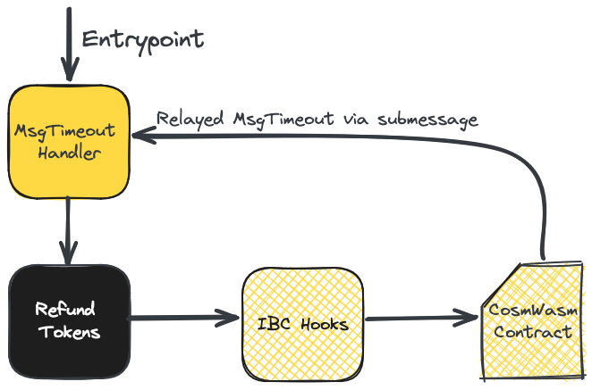

# Cosmos IBC Reentrancy Infinite Mint

In this article, we describe a vulnerability in [ibc-go](https://github.com/cosmos/ibc-go), the reference implementation of the Cosmos Inter-Blockchain Communication (IBC) protocol. A reentrancy vulnerability during the handling of timeout messages could have allowed an attacker to mint an infinite amount of IBC tokens on affected Cosmos chains.

While this vulnerability has existed in ibc-go since the beginning, it only became exploitable due to recent developments in the Cosmos SDK ecosystem, specifically CosmWasm-based IBC middleware.

We privately disclosed the vulnerability through the Cosmos HackerOne Bug Bounty program and the issue is now patched. No malicious exploitation took place and no funds were lost.

## Background

### Inter-Blockchain Communication (IBC)

[IBC](https://tutorials.cosmos.network/academy/3-ibc/1-what-is-ibc.html) is a light-client-based communication standard for exchanging information between Cosmos blockchains. Chain connections are permissionless and allow applications to communicate through so-called channels. 

With a general mechanism to communicate between blockchains, we can create other protocols on top of it - similar to the application layer of the web2 networking stack. The flagship IBC protocol is [ICS20](https://github.com/cosmos/ibc/blob/main/spec/app/ics-020-fungible-token-transfer/README.md) - a cross-chain token standard. This is used in almost every ecosystem, including Osmosis, for their trading pools.

To create an IBC application, developers must implement a custom module that implements callback functions that occur after packet verification has happened. There are three main calls where a callback must be implemented:

* **RecvPacket**: Handle an incoming packet from another chain.
* **AcknowledgePacket**: Handle an acknowledgment that the packet was received on the destination chain. 
* **TimeoutPacket**: Revert the state changes if the packet cannot be received on the destination chain. This is the one we're concerned about regarding the vulnerability. 

### CosmWasm

[CosmWasm](https://cosmwasm.com/) is a WebAssembly-based smart contract runtime for Cosmos. It is a Cosmos SDK module that developers can easily integrate into their projects. Most contracts are written in Rust, but could be written in any other language that compiles to Wasm.

One unique feature of CosmWasm is the concept of [submessages](https://docs.cosmwasm.com/docs/smart-contracts/message/submessage). Instead of making external calls to other contracts during execution of your contract, a contract can return a list of Cosmos messages which will be executed after its execution is completed. They can call other CosmWasm contracts or arbitrary Cosmos messages, such as the banking module.

### IBC Middleware

The ICS20 (interchain token standard) allows for cross-chain token use. However, custom functionality was desired to integrate into ICS20 and other IBC protocols, so the [IBC Middleware](https://ibc.cosmos.network/main/ibc/middleware/overview.html) specification was created. 

The idea is to wrap an existing IBC module to extend or change its functionality. With IBC hooks, it's possible to execute a CosmWasm contract upon successfully receiving ICS20 tokens. IBC hooks also contain handlers for Acknowledgment and Timeouts, which we will use later in the post.

Armed with this information, we are ready to tackle the vulnerability and its exploitation.

## Reentrancy Vulnerability

When sending a packet via IBC, the outgoing packet is stored as a commitment. If the packet was successfully received by the other Cosmos blockchain, a relayer will call the Acknowledgement functionality. If the packet was not successfully received, it will execute the Timeout functionality to revert state changes. For instance, the Timeout for ICS20 will refund tokens that were originally sent. The commitment is **deleted** once the processing is finished in both the Timeout and Acknowledgment cases. 

Functionally speaking, the commitment acts as replay protection. Deleting the commitment makes it impossible to submit the packet again for both handling cases.

The code below is from the end of the [Timeout](https://github.com/cosmos/ibc-go/blob/v8.1.1/modules/core/keeper/msg_server.go#L571-L580) handler and is unmodified. OnTimeoutPacket calls the application-specific logic once packet verification has been completed. After the callback, the packet commitment is deleted. 

```golang
// Perform application logic callback
err = cbs.OnTimeoutPacket(ctx, msg.Packet, relayer)
if err != nil {
	ctx.Logger().Error("timeout failed", "port-id", msg.Packet.SourcePort, "channel-id", msg.Packet.SourceChannel, "error", errorsmod.Wrap(err, "timeout packet callback failed"))
	return nil, errorsmod.Wrap(err, "timeout packet callback failed")
}

// Delete packet commitment
if err = k.ChannelKeeper.TimeoutExecuted(ctx, capability, msg.Packet); err != nil {
	return nil, err
}
```

The issue is that the execution flow leaves the module **before** deleting the commitment, which voids the replay protection control. This, in practice, violates the [checks-effects-interactions](https://docs.soliditylang.org/en/v0.6.11/security-considerations.html#use-the-checks-effects-interactions-pattern) (CEI) design pattern commonly referenced in Solidity development. Since the commitment still resides in storage, it's possible to abuse this behavior and reuse the same IBC timeout packet. This is a classic [reentrancy](https://www.alchemy.com/overviews/reentrancy-attack-solidity) bug but in a relatively unique context. To our knowledge, this is the first Cosmos-based reentrancy vulnerability.

## Exploitation

<p align="center">
  
</p>

Invoking an IBC callback without deleting the commitment allows reuse of the IBC timeout packet. To exploit this, we need a mechanism to reenter the IBC module's MsgTimeout handler. Using the previously discussed ICS20, CosmWasm and IBC hooks functionality, this is possible. 

IBC hooks allow for arbitrary CosmWasm contract calls from both the Acknowledgement and Timeout handlers via the CosmWasm keeper. Hence, we can use this to enter CosmWasm using IBC hooks. CosmWasm can return submessages to call arbitrary Cosmos messages. Putting this together, we can make a recursive call! In particular, a timed-out ICS20 transfer could call a malicious CosmWasm contract, returning another MsgTimeout call to reenter the IBC module. Once there, we can repeatedly trigger the refund process for the ICS20 token to create a multi-spend exploit scenario.

Step by step, this is how the exploitation process works:

1. Deploy a smart contract compliant with the IBC hooks callback for timeouts. 
2. Send IBC tokens back to the native chain using ibc-transfer CLI call with an expired timeout.
    1. **NOTE**: It is easy to force the timeout because the client state seems only to be updated when an IBC message is sent by relayers. So, there is also a slight desync in the block height between the two chains when verification is performed. 
3. Have a malicious relayer pick up the transfer.
4. Prepare two messages for a single CosmWasm execute() call
    1. MsgUpdateClient: The proof information between the destination and the source chain must be synced. So, this needs to be submitted before the timeout. 
    2. MsgTimeout: The timeout message is to be sent to the IBC module. This will have the ICS20 packet information to be refunded. 
5. Call the malicious CosmWasm contract using the prepared messages as parameters.
6. Save both of the prepared messages into the smart contract to be used later in future reentrant calls.
7. The two messages listed above are returned as submessages to call into Cosmos.
8. MsgUpdateClient succeeds.
9. MsgTimeout message is started.
10. The refund is completed after submitting the proof of non-existence from the destination chain. 
11. A callback into CosmWasm is made via IBC hooks in the middle of the MsgTimeout message. 
12. Trigger the MsgTimeout again via another submessage in the CosmWasm contract. 
13. Repeat 10-12 until all funds are stolen for a given token or the desired amount of IBC tokens are minted. 
14. On a CosmWasm call, return no submessages to stop the attack. The PoC uses a simple counter to prevent this from running out of gas mid-call.

A customized relayer using CosmJs with a bit of CosmWasm does most of the hard work for this proof of concept. An environment was set up in the Osmosis e2e framework for testing but the PoC would be portable to other mainnet environments with minor modifications. Here's the output from our proof of concept that performs the reentrant call 102 times: 

```
Token amount before attack: 1651816859293216191283200000000000000000000
IBC Transfer Message:
{
  sourcePort: 'transfer',
  sourceChannel: 'channel-0',
  token: {
	denom: 'ibc/ED07A3391A112B175915CD8FAF43A2DA8E4790EDE12566649D0C2F97716B8518',
	amount: '1651816859293216191283200000000000000000000'
  },
  sender: 'osmo19wpkq20hq9r08qht3qhrvya7fm00cflvrhu6s3',
  receiver: 'osmo19wpkq20hq9r08qht3qhrvya7fm00cflvrhu6s3',
  timeoutHeight: { revisionNumber: 0n, revisionHeight: 160545n },
  timeoutTimestamp: 1711468166642560638n,
  memo: '{"ibc_callback":"osmo13l8gwanf37938wgfv5yktmfzxjwaj4ysn4gl96vj78xcqqxlcrgs0k9uh9"}'
}
Getting MsgUpdateClient information...
Prepare MsgTimeout...
Execute malicious smart contract
Event 'coin_received' occurrences:  102
Token amount after attack: 168485319647908051510886400000000000000000000
```

To see the full proof of concept in action, watch [this video](https://www.youtube.com/watch?v=efA3Ce75n-c).

## Impact

With ICS20, two unique paths for transferring a token are important for understanding the impact. First, when sending a native token via IBC, the tokens are locked on the native chain and minted as an IBC-denominated token on the destination chain. When the source chain of the token is the receiver, this process is reversed; the IBC-denominated token is burned, and then the native token is unlocked and sent to the user.

In the case of ICS20 tokens, there is significant impact which can result in the theft of tokens from native and IBC-denominated tokens:

* **Native tokens**: 
    * Send some native chain tokens to the ICS20 module and force a timeout. This can be used to steal all the tokens within these escrowed accounts.

* **IBC tokens on the same chain**:
    * This reentrancy behavior makes it possible to mint an infinite amount of IBC tokens on the vulnerable chain. The arbitrary mint was shown in the proof of concept above. This has two significant consequences:
        * An attacker could bridge the minted tokens to the original chain to steal the locked native tokens on any other IBC-connected chain, such as the Cosmos Hub or Axelar bridged assets.
        * The IBC tokens can be swapped on the affected chain itself. For instance, if liquidity pools are using IBC tokens, the pool could be drained of non-IBC tokens.

We found several chains vulnerable to this issue, but Osmosis was the largest in TVL. We believe at least 126M+ in assets could have been stolen on Osmosis. However, rate limiting on Osmosis slows down the damage that could be caused.

Many CosmWasm chains, including Osmosis, require specialized permission to upload Wasm code. For chains with deployment restrictions, a governance proposal with this malicious code smuggled in or an allow-listed user's private key would need to be compromised to exploit this vulnerability. Defense-in-depth served to limit the blast radius of this vulnerability in these cases, which is good from an ecosystem security perspective.

## Conclusion

This issue demonstrates how easy it is to break trust assumptions and introduce new vulnerabilities by adding new features and functionality. It is also another example of the importance of defense-in-depth. Rate limits, permissioned deployment of CosmWasm contracts, and various other protections prevented this vulnerability from being immediately exploitable on many chains. Although these features might not be exciting or popular they can save protocols from existential risk. 

The teams at Cosmos and other affected projects did a great job resolving this issue and keeping funds safe. A binary patch was released to fix the underlying IBC timeout reentrancy without breaking consensus. Contributors spent much time and effort assessing the security implications of the mentioned issues. Thanks to the IBC-go team at the Interchain Foundation, [Jessy](https://twitter.com/jessysaurusrex?lang=en) and Mo from Amulet, and everyone directly involved for their professionalism in this case. 

## Timeline

* 2024-03-26 - Bug reported to ICF via HackerOne
* 2024-03-26 - ICF acknowledges receipt
* 2024-03-27 - ICF confirms that the report is valid
* 2024-03-31 - ICF communicates with affected chains
* 2024-04-05 - ibc-go [advisory](https://github.com/cosmos/ibc-go/security/advisories/GHSA-j496-crgh-34mx) published