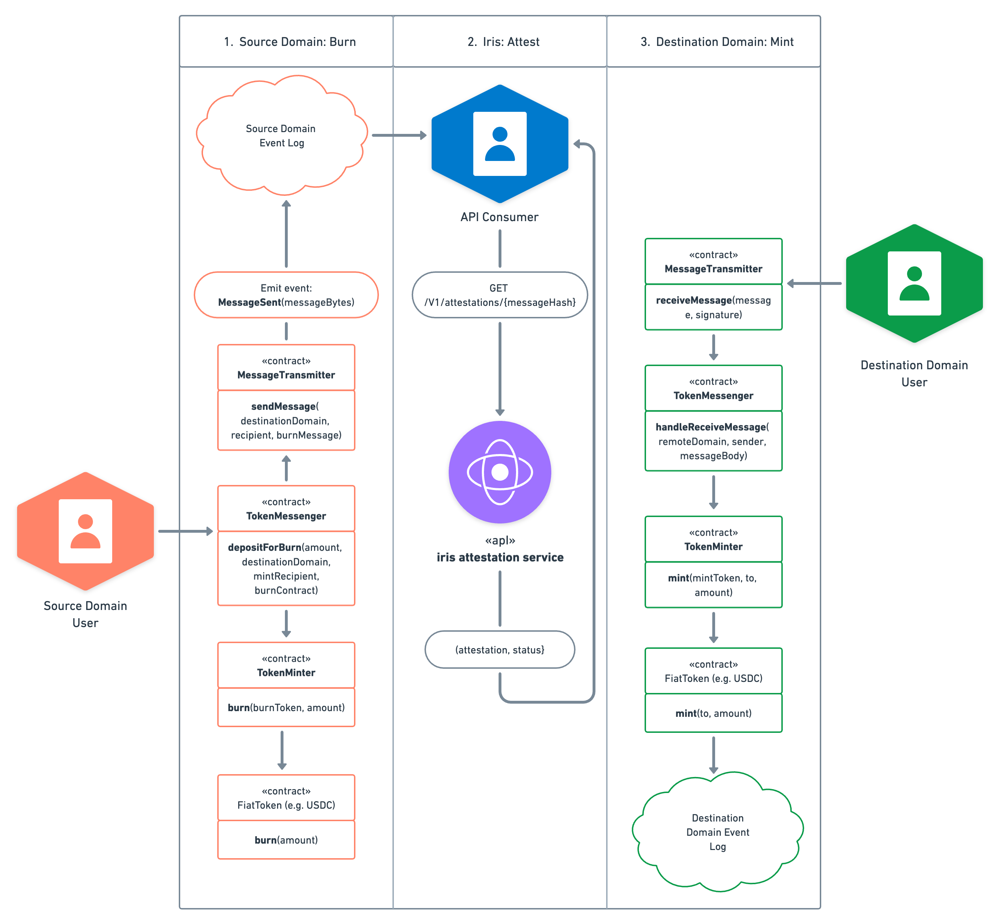

# Circle Noble CCTP Mint Bug

## Intro

We privately disclosed a vulnerability to Circle via their bug bounty program. The vulnerability was limited to Circle's [noble-cctp](https://github.com/circlefin/noble-cctp), which supports the USDC [Cross-Chain Transfer Protocol](https://www.circle.com/en/cross-chain-transfer-protocol) (CCTP) on Cosmos. As discussed below, the vulnerability could have been exploited by circumventing the CCTP message sender verification process to potentially mint fake USDC tokens on [Noble](https://www.noble.xyz/).

Notably, no malicious exploitation took place, and no user funds were lost. Circle promptly took action, once notified, to fix the bug. This blog describes what we found in detail. 

## Noble and CCTP

Noble is a purpose-built Cosmos app chain designed for native asset issuance, starting with USDC. By leveraging Cosmos SDK and the Inter-Blockchain Communication (IBC) protocol, Noble enables seamless USDC transfer to other supported Cosmos chains. Furthermore, support for CCTP allows USDC to be moved to and from Solana and EVM-based chains. CCTP is a permissionless on-chain standard that facilitates message and asset passing between blockchain networks. It supports asset transfers through native burning and minting. On Noble, CCTP is implemented as a built-in Cosmos SDK module called [noble-cctp](https://github.com/circlefin/noble-cctp), rather than as a set of smart contracts like for EVM ([evm-cctp-contracts](https://github.com/circlefin/evm-cctp-contracts)) or programs in Solana ([solana-cctp-contracts](https://github.com/circlefin/solana-cctp-contracts)). This integrated approach has already proven successful, with the Noble module minting more than $200M USDC on the Noble chain.

## Cross-Chain Transfer Protocol

While CCTP is primarily used for transferring assets, it's designed as a general message-passing protocol. Consider this example for sending USDC from one EVM chain to another.

<p align="center">
  
</p>

We can see that CCTP provides two smart contracts for the source domain and destination domain, **TokenMessenger** and **MessageTransmitter**. For sending assets such as USDC, the following steps need to happen:

1. **Depositing USDC on the source domain**: A user calls `depositForBurn()` on the **TokenMessenger** contract to burn native USDC. The **TokenMessenger** in turn talks to the **MessageTransmitter**'s `sendMessage()`. 

2. **Emitting a send message event on the source domain**: This message contract will then emit a chain event.

3. **Attestation of emitted messages by off-chain component**: Circle runs a proprietary off-chain component that monitors supported chains for such events and provides a signed attestation. 

4. **Receiving the attestation on the destination domain**: A relayer can then query this attestation and provide it to the destination's **MessageTransmitter** `receiveMessage()` function, verifying its legitimacy. Afterward, it forwards the message to the intended target contract, the destination's **TokenMessenger** contract. 

5. **Minting USDC on the target domain**: Finally, the `handleReceiveMessage()` function in **TokenMessenger** parses the message contents and now mints the initially burned amount of USDC to a specified receiver address. 

In the above scenario, the **TokenMessenger** contract sent out the CCTP message. However, the protocol is designed as a permissionless general message-passing protocol. Anyone can directly interact with the **MessageTransmitter** to send custom messages to supported destination domains and arbitrary contracts. 

This means that bridging tokens securely requires verification of the message's source chain ID and source domain address before minting them on the destination chain. Otherwise, the official **TokenMessenger** contract on chain B wouldn't know if the received message came from the expected **TokenMessenger** contract deployed on chain A.

## Noble CCTP Implementation on Cosmos

Let’s review the affected Cosmos component that Circle has since patched. As per the [documentation](https://developers.circle.com/stablecoins/docs/noble-cosmos-module:):

"Note that there are key differences between Cosmos appchains like Noble and EVM-compatible blockchains. Unlike on EVM chains where CCTP is a set of smart contracts, CCTP on Noble is a Cosmos SDK module deployed by Noble governance and built into the Noble blockchain. Cosmos app chains can use IBC to build composable flows with CCTP on Noble." 

In particular, this component had neither a **MessageTransmitter** nor a **TokenMessenger**. Instead, it's living in a dedicated CCTP module. Receiving messages is done via the `ReceiveMessage` method in [x/cctp/keeper/msg_server_receive_message.go](https://github.com/circlefin/noble-cctp/blob/master/x/cctp/keeper/msg_server_receive_message.go):

```golang
func (k msgServer) ReceiveMessage(goCtx context.Context, msg *types.MsgReceiveMessage) (*types.MsgReceiveMessageResponse, error) { 

	[...] 
	if err := VerifyAttestationSignatures(msg.Message, msg.Attestation, publicKeys, signatureThreshold.Amount); err != nil {
	[...]

	// verify and parse BurnMessage 
	if bytes.Equal(message.Recipient, types.PaddedModuleAddress) { // then mint 
	[...] 
	burnMessage, err := new(types.BurnMessage).Parse(message.MessageBody) 
	[...] 
	msgMint := fiattokenfactorytypes.MsgMint{ 
		From: types.ModuleAddress.String(), 
		Address: mintRecipient, 
		Amount: sdk.Coin{ 
			Denom: strings.ToLower(tokenPair.LocalToken), 
			Amount: sdk.NewIntFromBigInt(burnMessage.Amount.BigInt()), 
			}, 
	} 
	_, err = k.fiattokenfactory.Mint(ctx, &msgMint) 
}
```

In contrast to implementations on other blockchains, signature verification was done directly in the module and there is no **MessageTransmitter** equivalent. However, the critical check to ensure that the message is originating from a trusted **TokenMessenger** address on the source chain was missing as `message.Sender` is not verified. 

This meant that the noble-cctp `ReceiveMessage` handler was processing `BurnMessages` from any sender. An attacker could have been able to exploit this and trigger malicious USDC mints by sending a fake `BurnMessage` directly through a CCTP **MessageTransmitter** contract, using the noble-cctp module address and noble’s chainid as the CCTP destination. However, we did not identify any evidence of exploitation.

If Circle’s off-chain service had attested the emitted message, an attacker could submit it to the Noble chain and mint USDC to an account under their control. While the vulnerability looked like an infinite mint issue at first glance, Noble enforces a mint allowance in its `fiattokenfactory` module. At the time of our report, this limit was set to allow minting of roughly ~35M USDC, demonstrating the great importance of defense-in-depth features like mint limits. 

The Circle team quickly responded to our report and the bridge was paused a few hours after the submission. The issue is now fixed by verifying that the message sender is a valid [TokenMessenger](https://github.com/circlefin/noble-cctp/commit/253cf7eb943669e283b4dcb25f83c7096080e67a). 

## Conclusion

This vulnerability highlights the complexity of cross-chain bridge systems. Despite rigorous security practices, vulnerabilities can creep up due to inconsistencies across different ecosystem implementations. Thanks to Noble's defense-in-depth features and strict minting limits, the impact of this vulnerability was reduced. 

We thank Circle for its nearly immediate response to our report of this vulnerability.