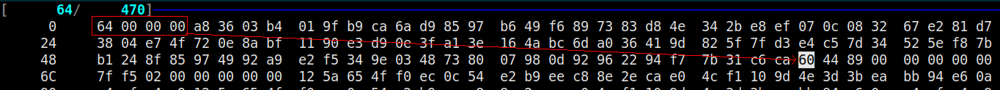
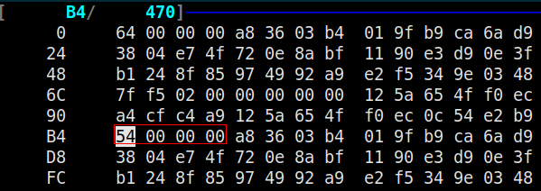
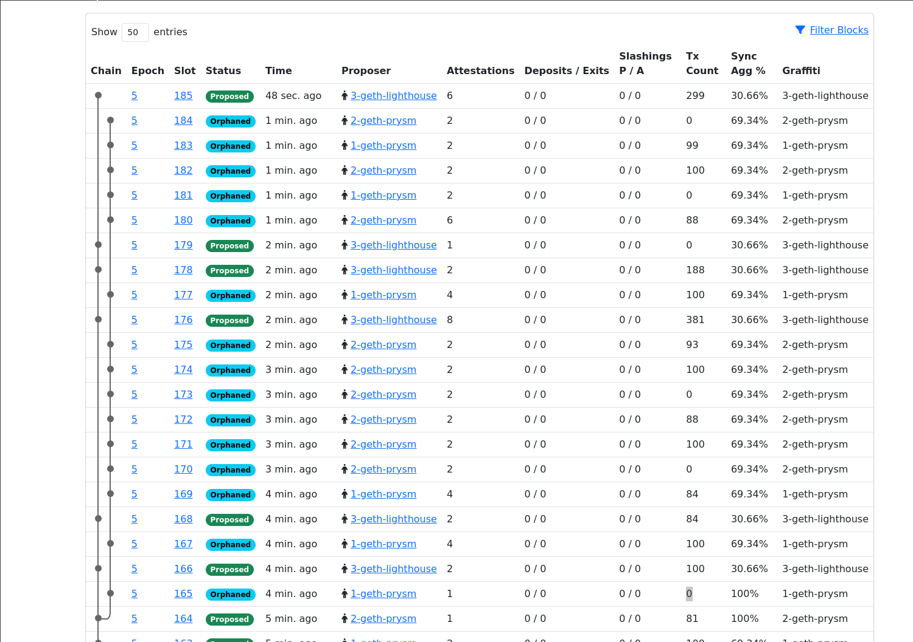
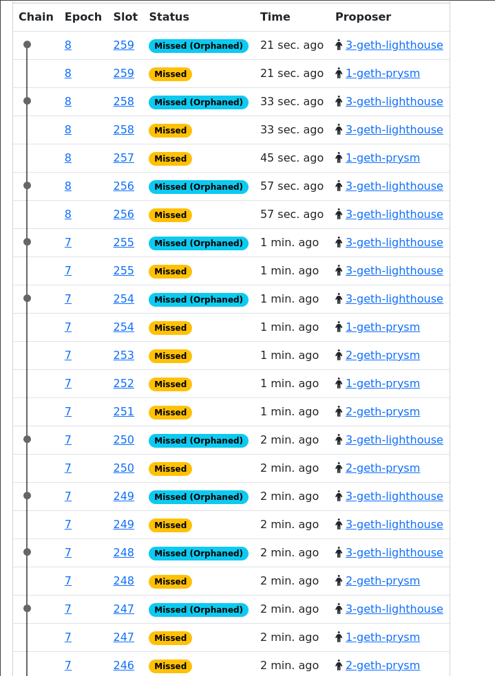

# Ghost in the Block: Ethereum Consensus Vulnerability

## INTRODUCTION

Ethereum’s Beacon Chain relies on Simple Serialize (SSZ) to serialize data structures involved in its consensus protocol and peer-to-peer communication. Ethereum 2.0’s consensus protocol is highly complex and requires that participating nodes can collectively and deterministically agree on a consistent view of the network state. 

For serialization, there can be only one valid encoding of the same object and only one interpretation of the same encoding. While [client diversity](https://ethereum.org/en/developers/docs/nodes-and-clients/client-diversity) is often a net positive for the security and resilience of a network, slight cross-client discrepancies in the implementation of core functionality like SSZ can have dramatic effects.

In this blog post, we will show how a small difference in SSZ deserialization between the [Prysm](https://github.com/prysmaticlabs/prysm) and [Lighthouse](https://github.com/sigp/lighthouse) clients could have allowed an attacker to severely degrade Ethereum consensus.

## TWO PROPERTIES OF SSZ

Blockchains are designed to work in a fully adversarial environment, where every node in the network is a potential adversary and hence cannot be trusted.  For this reason the network relies on invariants and properties that describe the expected behavior of network participants. There are no trust assumptions. The advantage is that these properties are well defined in specifications, which allows reasoning about their implications in a formal way.

For instance, among the several properties that must hold for the SSZ serialization and deserialization of consensus instances, the two listed below guarantee the **soundness** of both the communication and the consensus protocols:

1. involutive property: deserialize(serialize(A)) = A
2. iinjective property: serialize(A) = serialize(B) => A = B, where A and B are two objects of the same type.

These properties must hold for all objects in all implementations of SSZ and across all consensus clients. However, it is possible to forge objects for which the two properties do not hold in at least one implementation. An example of such an object is reported here, base64-encoded:

```
ZAAAAKg2A7QBn7nKatmFl7ZJ9olzg9hONCvo7wcMCDJn4oHXOATnT3IOir8RkOPZDj+hPhZKvG2gNkGdgl9/0+TFfTRSXvh7sSSPhZdJkqni9TSeA0hzgAeYDZKWIpT3ezHGymBEiQAAAAAAf/UCAAAAAAA+5sK5jMs82Ti7JupDU89FfZwhazaxtrjVujwJBXe0Wj7mwrmMyzzZOLsm6kNTz0V9nCFrNrG2uNW6PAkFd7RaVAAAAKg2A7QBn7nKatmFl7ZJ9olzg9hONCvo7wcMCDJn4oHXOATnT3IOir8RkOPZDj+hPhZKvG2gNkGdgl9/0+TFfTRSXvh7sSSPhZdJkqni9TSeA0hzgAeYDZKWIpT3ezHGyj7mwrmMyzzZOLsm6kNTz0V9nCFrNrG2uNW6PAkFd7RaCVEWAAAAAAA+5sK5jMs82Ti7JupDU89FfZwhazaxtrjVujwJBXe0Wj7mwrmMyzzZOLsm6kNTz0V9nCFrNrG2uNW6PAkFd7RaiAEAAIgBAACIAQAAiAEAAIgBAAAtNDsMn9UJs/D/SIvmsvWbK0C2aK7G3iQoOZPzWY7otEUtmGrsjPXSDPnQLZU2zVd5+XfJmjuQmYkNKV6mflygqDYDtAGfucpq2YWXtkn2iXOD2E40K+jvBwwIMmfigdc4BOdPcg6KvxGQ49kOP6E+Fkq8baA2QZ2CX3/T5MV9NFJe+HuxJI+Fl0mSqeL1NJ4DSHOAB5gNkpYilPd7McbKiAEAAOADAADgAwAAPubCuYzLPNk4uybqQ1PPRX2cIWs2sba41bo8CQV3tFpFAwmTtCRJ+hZWsL05YyjBW1KN0z7mwrmMyzzZOLsm6kNTz0V9nCFrNrG2uNW6PAkFd7RaPubCuYzLPNk4uybqQ1PPRX2cIWs2sba41bo8CQV3tFo+5sK5jMs82Ti7JupDU89FfZwhazaxtrjVujwJBXe0Wi00Owyf1Qmz8P9Ii+ay9ZsrQLZorsbeJCg5k/NZjui0RS2YauyM9dIM+dAtlTbNV3n5d8maO5CZiQ0pXqZ+XKCM6T2bRQMJk7QkSfoWVrC9OWMowVtSjdN4fB2u4hPzZQQtuuLuyNLgA0z3Td0jAyHW1RZ6EquiLwCI6Wu15Vw1pXnR5KNiUddpMpW53zKZLXIBSvV/KbpLxJdHNvQmh/Ekir/CKwuD1jZRUwjf4W2T2t+FTSr6D9zjxqJfzLABUkBTVzy5ZN14+YsJfTrd1g2yPZrU6V+OUSq1HSMrhXOMPubCuYzLPNk4uybqQ1PPRX2cIWs2sba41bo8CQV3tFqzAi4BAAAAAIDDyQEAAAAAvfaNAAAAAADXZDVmAAAAADgCAAA+5sK5jMs82Ti7JupDU89FfZwhazaxtrjVujwJBXe0Wj7mwrmMyzzZOLsm6kNTz0V9nCFrNrG2uNW6PAkFd7RaWAIAAFgCAAAAAAAAAAAAAAAAAAAAAAAARQMJk7QkSfoWVrC9OWMowVtSjdN4fB2u4hPzZQQtuuI2NjY2NjY2NkUDCZO0JEn6FlawvTljKMFbUo3TeHwdruIT82UELbri
```

The object encodes an Ethereum beacon block obtained by invoking the `MarshalSSZ` method of a regular `SignedBeaconBlockDeneb` structure used in the Prysm beacon client implementation. However, as described in the details below, some of the block's offsets have been manipulated to add a "ghost" region that does not cause deserialization to fail. Indeed, the `UnmarshalSSZ` method of `SignedBeaconBlockDeneb` deserializes the block instead of producing an error. Furthermore, they will differ if one serializes back the deserialized block and compares the two SSZ encodings. In other words, the following code will panic at "Step 2":

```go
import (
	consensus "github.com/prysmaticlabs/prysm/v5/proto/prysm/v1alpha1"
	...
)
	...
	// data is the serialized "ghosty" object
	B := consensus.SignedBeaconBlockDeneb{}
	err = B.UnmarshalSSZ(data)
	if err != nil {
		panic(err)
	}

	X, err := B.MarshalSSZ()
	if err != nil {
		panic("Step 1: Deserialize-Serialize -- could not serialize back the deserialized input block")
	}

	if !reflect.DeepEqual(data, X) {
		fmt.Printf("%v\n\n%v\n", data, X)
		panic("Step 2: Deserialize-Serialize -- input != serialize(deserialize(input))")
	}
```

We can translate these basic facts into the following equations:

```
  I. B = deserialize(data)
 II. X = serialize(B)
III. X != data
```

We can then show that the two properties 1. (Involutive) and 2. (Injective) above **do not hold**. Given that the deserialization of the spurious objects `O` represented by data succeeds, it holds that `data = serialize’(O)`, for some serialization function `serialize’`; therefore:

```
 I. B = deserialize(data) = deserialize(serialize’(O))
II. X = serialize(B) = serialize(deserialize(serialize’(O)) // by I.
      = serialize’(O)  // by involutive property 1.
      = data
```

but (III) above says `X != data`, which leads to a contradiction. For a single-client network this violation does not have much impact. However, in a multi-client environment this could be a source of disagreement, resulting in a failure to reach consensus.

## GHOST REGIONS

The reasoning above just says: were the properties correctly guaranteed by the implementation, there **could not be** two different encodings for the same objects without incurring a logical impossibility. However, since the two deserializations yield the same object, the forged encoding does not alter the underlying object; it only alters its representation. This means that modifying the signed block does not alter its hash tree root, which implies that the block signature does not change either. From the adversary's point of view, this opens the possibility of altering blocks emitted and signed by other network participants.

Let’s see what a signed block looks like in serialized form.

SSZ relies on offsets and lengths within the encoded objects. In the case of a `SignedBeaconBlockDeneb`, which is the object that is transmitted to other peers across the gossip network, there are several other embedded objects that we must take into account. For instance, the block itself is part of a larger object, and we must first locate it within the signed container:

```go
func (s *SignedBeaconBlockDeneb) UnmarshalSSZ(buf []byte) error {
[...]
	tail := buf
	var o0 uint64

 	// Offset (0) 'Message'
	if o0 = ssz.ReadOffset(buf[0:4]); o0 > size {
		return ssz.ErrOffset
	}
```

The deserialization code refers to the block object as the “Message” because the other segment in the container is its signature. The offset of the block is stored in the first four bytes of the serialized object:

<p align="center">
  
</p>

Once the deserializer knows where to find the block, it invokes its `UnmarshalSSZ` method (notice in the code below the different receiving type). The block itself embeds another object, the body, whose deserialize instructions can be found in the method with the same name:

```go
func (b *BeaconBlockDeneb) UnmarshalSSZ(buf []byte) error {
[...]
	// Offset (4) Body
	if o4 = ssz.ReadOffset(buf[80:84]); o4 > size {
		return ssz.ErrOffset
	}

	if o4 < 84 {
		return ssz.ErrInvalidVariableOffset
	}

	// Field (4) Body
	{
		buf = tail[o4:]
		if b.Body == nil {
			b.Body = new(BeaconBlockBodyDeneb)
		}
		if err = b.Body.UnmarshalSSZ(buf); err != nil {
			return err
		}
	}
```

The code says that the offset at which the body is located is 80 bytes past the beginning of the block:

<p align="center">
  
</p>

The offset is 0x54, so we must add the block offset, 0x64, which means the body is at offset 0xB8 within the outer container (next to its offset).

The body is another container for further objects, whose types all use the `UnmarshalSSZ` method. In this order, we repeat the same operations above (i.e., locate the offset first, then unmarshal the object) for the other serialized structures: `ExecutionPayload`, `BlsToExecutionChanges`, and `BlobKzgCommitments`. The execution payload refers to the execution layer data and, expectedly, embeds other objects named `ExtraData`, `Transactions`, and `Withdrawals`. We also need these offsets to have a complete picture of the signed block.

We call their offsets `o9`, `o10`, `o11`, `o20`, `o23`, `o24`, such that:

```go
// Offset (9) 'ExecutionPayload'
o9 = body[380:384]
// Offset (10) 'BlsToExecutionChanges'
o10 = body[384:388]
// Offset (11) 'BlobKzgCommitments'
o11 = body[388:392]
execPayload := body[o9:o10]
// Offset (10) 'ExtraData'
o20 = execPayload[436:440]
// Offset (13) 'Transactions'
o23 = execPayload[504:508]
// Offset (14) 'Withdrawals'
o24 = execPayload[508:512]
extraData := execPayload[o20:o23]
```

It is important to remember that all these segments are contiguous within the serialized object. 

Let’s assume now, without loss of generality, that the `Transactions` array, the `BlsToExecutionChanges`, and the `BlobKzgCommitments` are empty. In the example block, the values of their offsets are:

```
o9=1dc, o10=40c, o11=40c, o20=3ec, o23=40c, o24=40c
```

We notice that the offsets of `BlsToExecutionChanges`, `BlobKzgCommitments`, `Transactions`, and `Withdrawals` coincide with 0x40c, which in our case is the end of the whole serialized container, i.e. the signed beacon block. 

Our strategy is to insert a **ghost region** of 8 bytes before the start of the `ExtraData`, i.e. before o20; relocate the `ExtraData` by shifting `o20` and `o23` and copying its bytes back, and shifting `o24`, `o10`, and `o11` to trick the deserializer into thinking that the end of the block is farther than the original one.

This strategy only depends on specific data structures involved as long as they can be moved toward the block's end. This would guarantee that the object's hash tree root, once deserialized, stays the same, displacing the need to recalculate the signature.

In other words, one could alter the offsets in the serialized block somewhat arbitrarily and create interstitial ghost regions between objects without ever affecting the resulting deserialization, based on the observation that the deserializer assumes the block to be well-formed as long as the offsets of the respective objects in the block are coherent with respect to each other. No other consistency checks are enforced to guarantee that the serialized object carries only the consensus substructures and only those.

## PROOF OF CONCEPT

We have just shown that the soundness properties of SSZ do not hold for one library and one client in particular. Everything would be fine if other implementations behaved the same. They would agree on interpreting these peculiar blocks and reach a consensus. 

In the Ethereum ecosystem, [fastssz](https://github.com/ferranbt/fastssz) is the serialization library used by Prysm. The Lighthouse consensus client uses a different approach to deserialization. Indeed, if we ask the Lighthouse command-line block parser, the “ghost” block gets rejected:

```
./target/release/lcli pretty-ssz SignedBeaconBlockDeneb signed-ghost-deneb.ssz --spec mainnet
Failed to run lcli: Failed to pretty print hex: SSZ decode failed: OffsetSkipsVariableBytes(568)
```

Therefore, we could envision a situation in which a consensus network composed of heterogeneous clients **never reaches a consensus** on these blocks, which are entirely valid blocks according to the Prysm client. After all, Prysm and Lighthouse [account](https://clientdiversity.org/) for most of the consensus nodes in the Ethereum beacon chain, and bringing them to disagree must necessarily have ripple effects on the whole network.

To prove this claim, we [modified the Prysm](https://gist.github.com/sbudella-gco/910fafca7b3846e92d6945374bdd5b9a) client to forge the ghost blocks programmatically; more specifically, we modified the `EncodeGossip` method of `SszNetworkEncoder` under `beacon-chain/p2p/encoder/ssz.go`, where the signed blocks are encoded just before being propagated to the gossip network. As said, the manipulation does not alter the hash tree root, so we did not need to recompute the block signature. 

We built a local devnet composed of three nodes: one “malicious” Prysm patched as described, one “pristine” Prysm, and one “pristine” Lighthouse, all connected to their own Geth instances. As shown in the figures below, the network partitions into two chains first:

<p align="center">
  
</p>

The forking slot contains a “ghost” block proposed by the malicious node 1-geth-prysm:

```
[cl-1-prysm-geth] Ghost in the block -- before hash  c38ff56fbc70f2204dbc2a160b51a011795764558af279e006a4fec93a6321c0
[cl-1-prysm-geth] Ghost in the block -- after hash  c38ff56fbc70f2204dbc2a160b51a011795764558af279e006a4fec93a6321c0
[cl-1-prysm-geth] time="2024-06-07 12:19:48" level=info msg="Synced new block" block=0xc38ff56f... epoch=5 finalizedEpoch=3 finalizedRoot=0xe88d237b... pref│
ix=blockchain slot=165
```

After a while, all nodes stop talking to each other. In particular, the Lighthouse node is reporting this log message:

```
[cl-3-lighthouse-geth] Jun 07 12:40:41.270 WARN Could not publish message kind: sync_committee_0, error: InsufficientPeers
```

The final result is that, from the blockchain's point of view, the network halts completely because new blocks cannot be produced.

<p align="center">
  
</p>

## CONCLUSION

The Ethereum Foundation has spearheaded much innovative work in security engineering by introducing the beacon chain. Each passage in the specifications and related documents is underpinned by careful thinking about the adversary and its capabilities.

Core blockchain infrastructure security requires thinking across multiple layers, including the economic tradeoffs to pull off attacks that, most of the time, aim at disrupting the network or partitioning it to such a degree that the adversary may increase its chances of gaining a majority. For this reason, certain design choices like the incentivized diverse ecosystem could never seem more appropriate. However, ensuring that further local design choices for each implementation introduce no divergence might not be bulletproof, if only because there are too many places where these divergences could occur, regardless of how precise the specification is. Longstanding differential fuzzing initiatives like [beacon-fuzz](https://github.com/sigp/beacon-fuzz) might still miss a spot, as the present case shows. Paradoxically enough, the same design choice of favoring multiple implementations has brought a new vulnerability class, that of “consensus bugs”, on which we hopefully shed some new light.

As we’ve probably only scratched the surface, and also considering the vast amount of code in these implementations, whose regular unit tests could not be deemed sufficient for the task, the call to develop novel security techniques is a very current topic. By finding means to estimate precisely the eventual distance from the specification induced by the implementation and how many “behaviors” the specification itself fails to capture, we would already be in a better position to evaluate the security of the network in purely computational terms.
